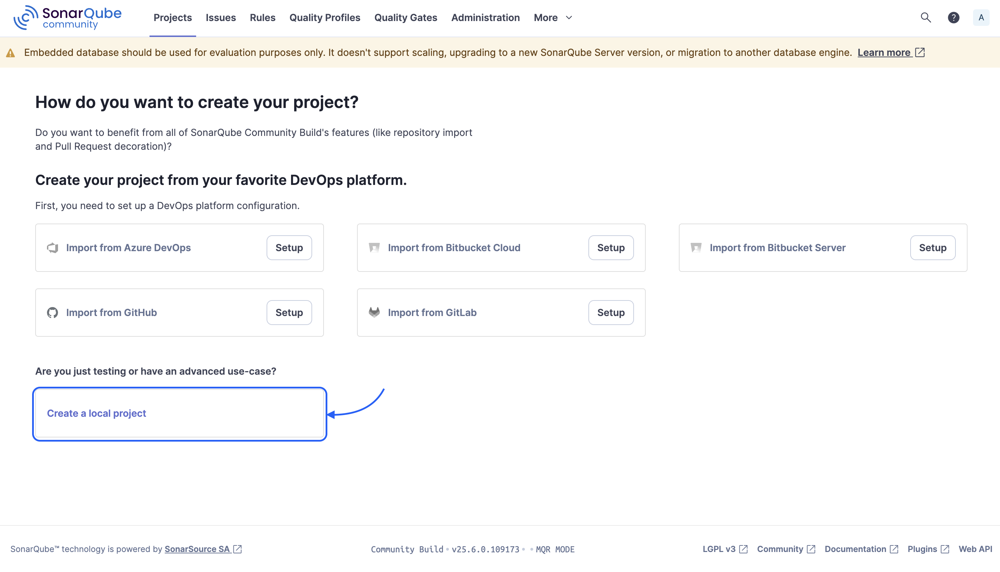
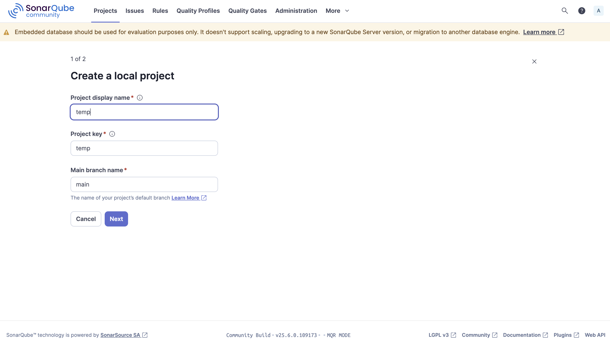
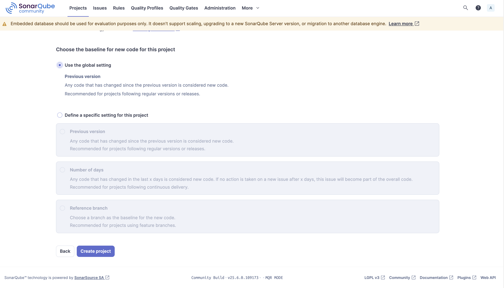
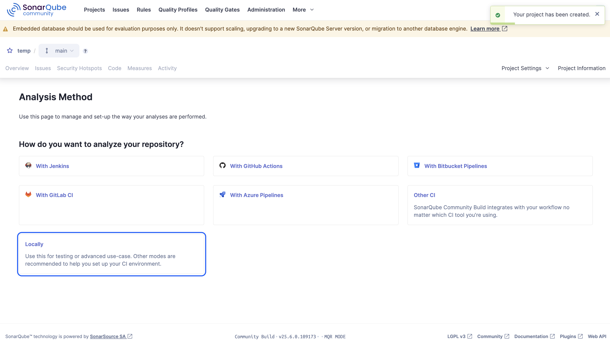
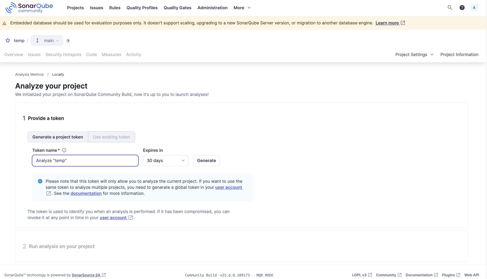
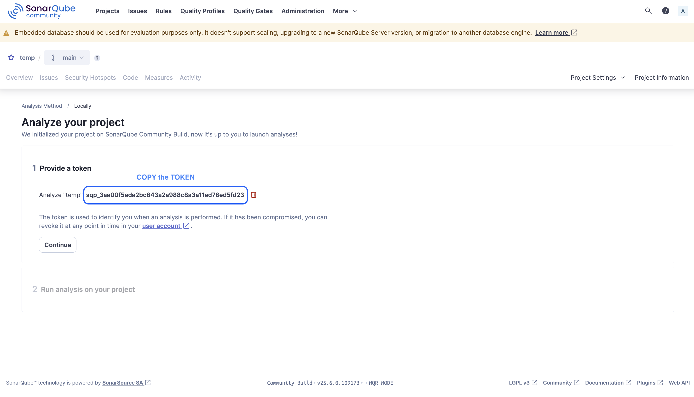
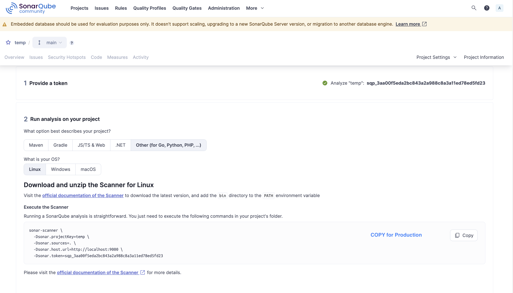
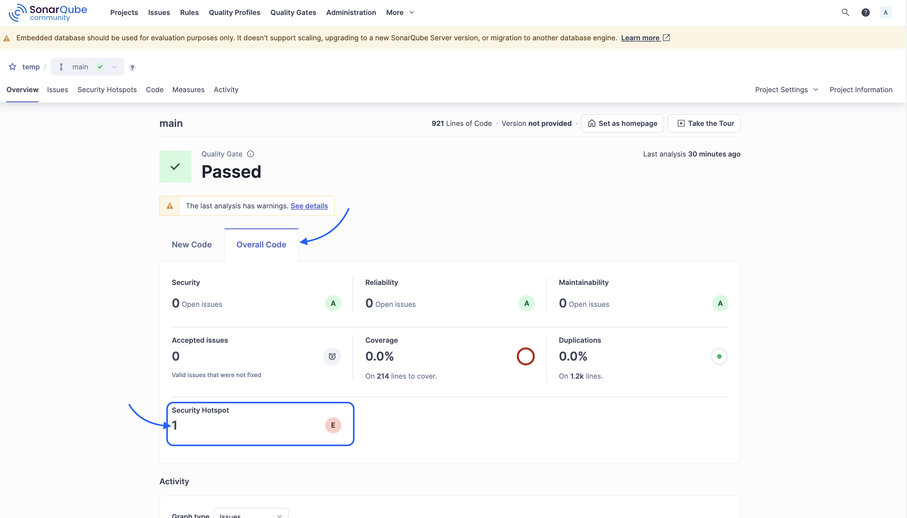
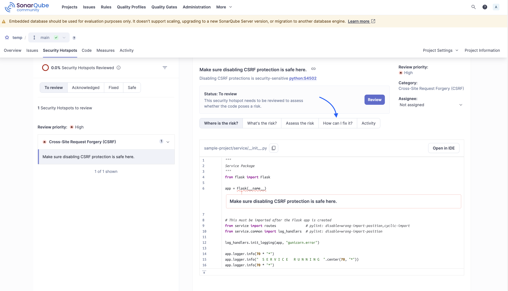

# 🔍 SonarQube Static Code Analysis Lab

This project demonstrates the local use of **SonarQube** for static code analysis with Docker containers. It is based on the IBM Skills Network Lab.

## 🧠 Learning objectives

- Setting up SonarQube and PostgreSQL with Docker
- Using the SonarQube scanner for local code analysis
- Interpretation of security scans and suggestions for improvement

---

## 🚀 Quick start

### Prerequisites

- [Docker](https://www.docker.com/) installed
- Bash shell (e.g. Terminal, Git Bash, WSL)

### Setup

#### 1. Install and Run PostgreSQL & SonarQube

```bash
# Create Docker network
docker network create mynet

# Start PostgreSQL
docker run --name postgres \
  -e POSTGRES_USER=root -e POSTGRES_PASSWORD=Test12345 \
  -p 5432:5432 --network mynet -d postgres

# Start SonarQube
docker run -d --name sonarqube \
  -p 9000:9000 \
  -e sonar.jdbc.url=jdbc:postgresql://postgres/postgres \
  -e sonar.jdbc.username=root \
  -e sonar.jdbc.password=Test12345 \
  --network mynet sonarqube
```

#### 2. Container Check

Now that both PostgreSQL and SonarQube images have been downloaded, and both containers have been started, you can use the `docker ps` command to check that they are running, it should look like this:

```bash
user@pc: docker ps
CONTAINER ID   IMAGE          COMMAND                  CREATED          STATUS          PORTS                    NAMES
e2ec5429b636   postgres       "docker-entrypoint.s…"   7 minutes ago    Up 7 minutes    0.0.0.0:5432->5432/tcp   sq-postgres
eb0a0ab87d1a   sonarqube      "/opt/sonarqube/dock…"   8 minutes ago    Up 8 minutes    0.0.0.0:9000->9000/tcp   sonarqube
```

#### 3. Log in to SonarQube

You are now ready to use SonarQube. You can launch the web UI by opening `http://localhost:9000/`. It may take a while for SonarQube to start.

1. Use the following default credentials to login into the SonarQube.

    > username: `admin`
    > password: `admin`

2. Then click the [Log in] button. Once you have logged in, you will be prompted to change your password.

    > [!NOTE]
    > Don’t forget to save your new password!

3. Once you have finished resetting the password, you will be directed to the home page of SonarQube.

#### 4. Create a SonarQube Project

To run the SonarQube scanner on your code, you will first need to create a project token. There are many ways to create a token, but for this lab you will use the manual setup.

1. Click on the 'Create a local project' button on the bottom left.
    

2. On the next page, create a project by following these steps:

    1. Set the project display name to `temp`
    2. Set the project key to temp (this will happen by default)
    3. Ensure the main branch is selected
    4. Press the Next button to continue.

    

    > [!NOTE]
    > If you get an error message, try again.

3. Please select `Use the global setting` and then click on `Create project`.

    

4. On the next page, where it asks how you want to analyze your repository, select the `Locally` option.

    

#### 5. Generate SonarQube Scanner Token

Before you can scan your code, you will need to generate a token. You can generate a token on the Analyze your project page at the Provide a token step.

1. Click the `Generate` button.

    

2. Next, you will see the token that has been generated.
    > [!NOTE]
    > Copy it, and then paste it in a safe place. You will need it later to submit your scans.

3. Click the Continue button.
    

4. OS Configuration
    For the selections, you must choose:

    1. Other, (for JS, TS, Go, Python. PHP, …)
    2. Linux
    3. Copy

    > [!IMPORTANT]  
    > You don’t need to copy the generated snippet, since we are using a custom Docker setup.
    > Keep it for reference or use it in production environments.

    

It's important to understand that the SonarQube server (which stores and displays the results) and the scanner (which performs the code analysis) are two separate components.

Up until now, we’ve created a database for storing the analysis results and provisioned a SonarQube server for serving the UI.

### Prepare scanner

To get the SonarQube scanner to work in the Cloud IDE, you can either install it locally or pull its docker image and run its docker container. In this lab, you will be pulling the docker image and running its docker container.

1. First, we will use the docker pull command to download the sonarsource/sonar-scanner-cli image from Docker hub so that it is available locally for use.

    ```bash
    # Scanner-Pull
    docker pull sonarsource/sonar-scanner-cli
    ```

2. Run the following bash alias command in the terminal, which creates an alias sonar-scanner for running the scanner later via the sonar-scanner-cli Docker container:

    ```bash
    # Set bash alias
    alias sonar-scanner='docker run --rm -v "$(pwd):/usr/src" sonarsource/sonar-scanner-cli'
    ```

    > [!NOTE]
    > This command is mounting the current working directory as a volume at /usr/src inside the container, which is where sonar-scanner is looking for the source code. You can set this up on your own computer as well.

Any arguments that you pass into the sonar-scanner command will be passed into the container version as well. This is how you can easily run commands in Docker containers as if they were actually installed on your computer.

Now that the scanner is ready, let’s run it on a sample project!

---

## 📂 Example project

The sample project is located in the `sample-project/` folder and was provided by IBM.

> [!NOTE]
> [IBM GitHub Code](https://github.com/ibm-developer-skills-network/wtecc-CICD_PracticeCode.git)

---

## 🔍 Run SonarQube Scan

After creating a project and token at `http://localhost:9000`, you can paste the copied and saved TOKEN from SonarQube in this snippet:

```bash
sonar-scanner \
  -Dsonar.projectKey=temp \
  -Dsonar.sources=. \ 
  -Dsonar.host.url=http://host.docker.internal:9000 \   # Docker host (use this on Mac & Windows)
  -Dsonar.login=<YOUR-TOKEN>                            # Insert your TOKEN here
```

> [!TIP]
> If you lost your TOKEN, you can visit <http://localhost:9000/project/information?id=temp> and copy your TOKEN, to insert it in the snippet above.

---

## 🛡️ Security tips & results

### Terminal output

When the scan is finished, the end of the output should look like this:

```bash
20:45:31.369 INFO  ANALYSIS SUCCESSFUL, you can find the results at: http://host.docker.internal:9000/dashboard?id=temp
20:45:31.369 INFO  Note that you will be able to access the updated dashboard once the server has processed the submitted analysis report
20:45:31.369 INFO  More about the report processing at http://host.docker.internal:9000/api/ce/task?id=ac0d4df6-0302-4cef-91cd-c909fa758d0b
20:45:31.390 INFO  Analysis total time: 12.564 s
20:45:31.394 INFO  SonarScanner Engine completed successfully
20:45:31.795 INFO  EXECUTION SUCCESS
20:45:31.838 INFO  Total time: 22.381s
```

### SonarQube UI

#### 1. Now visit the SonarQube UI under: <http://localhost:9000/dashboard?id=temp>

#### 2. Open the `Overall Code` Tab [🔗](http://localhost:9000/dashboard?id=temp&codeScope=overall)

#### 3. Find the `Security Hotspot` and click the Number `1` for Details [🔗](http://localhost:9000/security_hotspots?id=temp)



#### 4. Security Hotspots Page

In our sample project, SonarQube detected a CSRF vulnerability, highlighted under **Security Hotspots**. The report includes contextual tabs such as:

- 🔍 **Where is the risk?** – shows the vulnerable code line
- ⚠️ **What’s the risk?** – describes why it’s a problem
- 💡 **How can I fix it?** – offers a specific solution



---

## 🧪 Optional: CI integration

Optionally, a GitHub Actions Pipeline can be set up, which SonarQube uses with every push.

Example:

```yaml
# .github/workflows/sonarqube.yml
on:
  push:
    branches: [ main ]

jobs:
  sonarqube:
    runs-on: ubuntu-latest
    steps:
      - name: Checkout repo
        uses: actions/checkout@v3

      - name: Run SonarQube scanner
        uses: SonarSource/sonarcloud-github-action@v2
        env:
          SONAR_TOKEN: ${{ secrets.SONAR_TOKEN }}
        with:
          args: >
            -Dsonar.projectKey=temp
            -Dsonar.organization=your-org
            -Dsonar.host.url=https://sonarcloud.io

```

---

## 📄 License

This project is licensed under the [Apache License 2.0](LICENSE).  
The included `sample-project/` folder is based on the original IBM Labs repository [wtecc-CICD_PracticeCode](https://github.com/IBMDeveloperSkillsNetwork/wtecc-CICD_PracticeCode), which is also licensed under Apache 2.0.

---

## 🙋 Author

Created as part of the IBM Labs course: *Using Static Analysis*.
